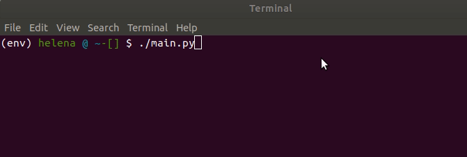

# List devices

Will list all devices available in the current project.

## Setup

First, install `pyhton3` and `pip3`, and then install `virtualenv`:

    pip3 install virtualenv

Then, setup and activate `virtualenv` for your project:

    virtualenv -p python3 env
    source env/bin/activate


Next, install dependencies:
```
$ pip install -r requirements.txt
```

## API key

Create a new API key for your Toit project, by executing the Toit CLI command:

```
$ toit project api-keys add <name-of-key>
```

Example:

```
$ toit project api-keys add MyAPIKey
```

View the list of API keys available in your project with the Toit CLI command:

```
$ toit project api-keys list
```

Note the ID of your API key.

View the generated API key *secret* with the Toit CLI command:

```
$ toit project api-keys print-secret <api-key-id>
```

Use the printed *secret* in the next step, when running the Python script.

## Run

Run the Python script:

```
$ ./main.py
```

The script will prompt for the API key secret as input.

When authenticated, the script will print all available devices in the current project.



